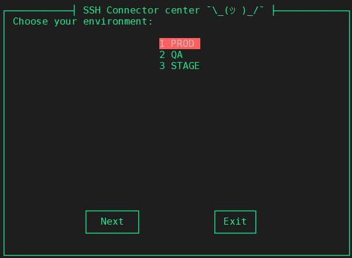

# SSH Connector service
- TUI - terminal user interface

Service with TUI interface, which helps you to connect to the different hosts using **sshd**.
### 1. Install sshd service
### 2. Configure  **~/.ssh/config** file in the similar format.
```
Host <IP>            # when jump host is using
Host *.<DOMAIN NAME> # when domain name is using
  ProxyJump  jumphost
  User <SSH USERNAME>
  IdentityFile <PATH TO PRIVATE SSH KEY>
Host *
  User <SSH USERNAME>
```
### 3. Keep *ssh_connector.sh* script in any directory.
Make the script executable with command:
```
chmod +x ssh_connector.sh
```
### 4. Create file with *host_list_<ENV_NAME>*
For example: host_list_PROD, host_list_STAGE, host_list_QA.
As result the next TUI will be created:


### 5. Content in *host_list_<ENV_NAME>* file should be in the next format:
```
<IP or DomainName>    <Comment about this host>
```


**NOTE**: New files with additional environment could be added or modified at any time. 
Changes will be added automatically during next run of script.
### 6. Create Custom Bash Command
1. Open your  **.bashrc** file:
```
vim ~/.bashrc
```
2. Add your command as alias:
```
alias <your_command>='/PATH/TO/FILE/ssh_connector.sh'
```
3. Update your command file through the terminal:
```
source ~/.bashrc
```
4. Run your command:
```
<your_command>
```
### NOTE: for MAC OS:
```
export LC_ALL=en_US.UTF-8
sed -i -e 's/\r$//' ssh_connector.sh 
```
